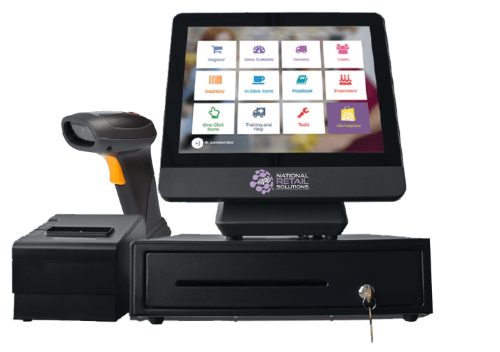
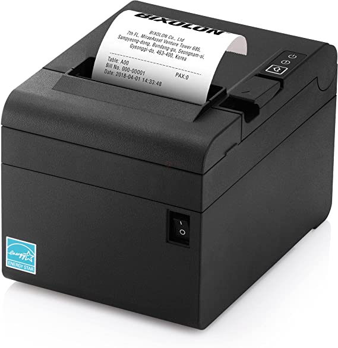

# Point of Sale (POS)
POS and Inventory Management System

## 1. Introduction

Point of sale (POS) system is the spot where your customer makes the payment for goods or services that are offered by your company.

Point of sale systems are systems that enable the business transaction between the client and the company to be completed. POS system is a software program that consists of a main computer linked with the inventory database and may also be linked with hardware devices like barcode scanners to easily identify the items and receipt printers to complete the cash payment and print the receipt.

## 2. Hardware 

Point of sale (POS) may be working without hardware devices, but it is preferred to use the following devices with them to achieve usability and productivity :

### 2.1 Devices

#### Barcode Scanner

A barcode reader, also called a price scanner or Point of Sale (POS) scanner, is a hand-held or stationary input device used to capture and read the information contained in a barcode.

A barcode reader comprises a scanner, a decoder (either built-in or external), and a cable used to connect the reader to the computer or POS system.

#### Receipt Printer 

A receipt printer is a small device that prints out customer receipts. 
They are most commonly used in retail shops, gas stations, and restaurants. Food service settings may have both a front-of-house receipt printer for payments and a back-of-house receipt printer for order tickets. The two most common types of receipt printers are impact printers and thermal printers.

## 3. Software

